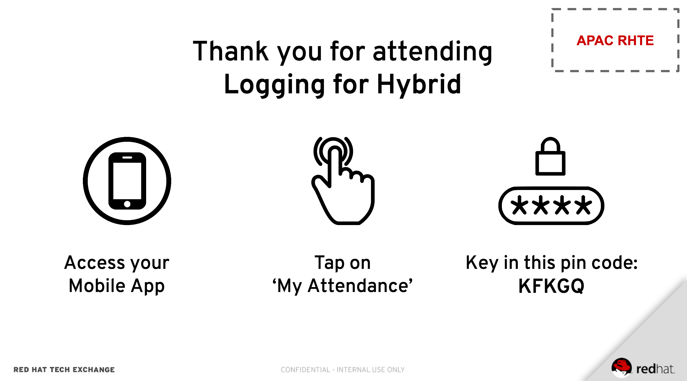

:opencf: link:https://labs.opentlc.com/[OPENTLC lab portal^]
:account_management: link:https://www.opentlc.com/account/[OPENTLC Account Management page^]
:quay_hostname: quay.rhte.example.opentlc.com
:cluster_base: REPL.rhte.opentlc.com
:cluster_master: master.{cluster_base}
:bastion: bastion.{cluster_base}
:kibana: https://kibana.apps.{cluster_base}
:application1: app1
:application2: app2
:oc_version: 3.10.14
:oc_download_location: https://mirror.openshift.com/pub/openshift-v3/clients/{oc_version}

= Logging OpenShift Lab
:toc:
== Lab Overview

Welcome to the RHTE Logging for Hybrid Cloud lab. This lab is based on the Aggregated Logging feature available on OpenShift Container Platform (OCP). This Aggregated Logging is based on the popular Elasticsearch, Fluentd, Kibana (EFK) stack.

The Aggregated Logging feature aggregates node (system), Kubernetes events, and pod logs and saves it for search, analysis and dashboards.

In the lab, expect to learn how to install, and upgrade the aggregated Logging Stack and use the powerful features of Kibana to visualize logs for troubleshooting and for dashboards.

== Lab Setup

=== Configure the OpenShift Command Line Interface

In this lab, you use the command line for some of the tasks. The lab assumes that you are using your laptop and a local OpenShift command line utility.

You will need version {oc_version} of the OpenShift command line utility. If you already have the OpenShift CLI installed you can check the version installed:

[source,bash]
----
oc version
----

.Sample Output
[source,text]
----
oc v3.10.14
kubernetes v1.10.0+b81c8f8
features: Basic-Auth
----

Make sure the the version displayed matches {oc_version}.

If it does not you can download the correct version of the OpenShift Command Line interface from {oc_download_location}. In this directory you will find a `linux`, `windows` and `macosx` subdirectory. Navigate to the directory for your operating system and download the OpenShift command line utility (oc.tar.gz for Linux and MacOS or oc.zip for Windows). You will need need to unarchive the downloaded file and then move the "oc" binary into a directory in your PATH (usually $HOME/bin).

Then verify again that the version displayed is corect.

=== These are your lab end points

cluster base(all hosts are subdomains of the cluster_base): {cluster_base}

cluster master URL: {cluster_master}

bastion host: {bastion}

kibana URL: {kibana}

Where REPL = Lab Attendees GUID

=== Connect to the OpenShift Cluster via oc

Make sure you can log in to the OpenShift cluster.

[NOTE]
The cluster URL is https://{cluster_master}.

. Use the `oc login` command to log in to the cluster, making sure to replace the URLs with your cluster's URLs:
+
[source,text]
----
oc login -u user1 -p r3dh4t1! <CLUSTER_URL>
----
+
[NOTE]
If you see a warning about an insecure certificate, type `y` to connect insecurely.
+
.Sample Output
[source,text]
----
Login successful.

You don't have any projects. You can try to create a new project, by running

    oc new-project <projectname>
----

=== Connect to the OpenShift Web Console

Make sure you can log in to the OpenShift cluster as user2.

[NOTE]
The cluster URL is https://{cluster_master}.

[NOTE]
We recommend that you use "incognito" or "private browsing" mode of your browser, since we will use several users and we don't want to mix up the cookies.

. Use your web browser to log in to the cluster https://{cluster_master}.
. At the login prompt use username `user2` and password `r3dh4t1!`

=== Connect to the bastion host via ssh

In this section we will demonstrate how to become root on bastion host to be able to execute Ansible playbooks against the cluster.
You will also add cluster-admin privileges to "user2".

. Connect to the {bastion} host via SSH using the password `r3dh4t1!`:
+
[source,bash]
----
ssh lab-user@bastion.REPL.rhte.opentlc.com
----
+
. Once you're on the bastion host, become root:
+
[source,bash]
----
sudo -i
----
+
. Check that you're `system:admin` on your OpenShift cluster:
+
[source,bash]
----
oc whoami
----
+
You should see
+
.Output
[source,text]
----
system:admin
----
+
. OpenShift cluster has pre-created users. We will be using `user1` and `user2`. Please execute the following command to add `cluster-admin` privileges to the `user2`:
+
[source,bash]
----
oc adm policy add-cluster-role-to-user cluster-admin user2
----
+
You should see
+
.Output
[source,text]
----
cluster role "cluster-admin" added: "user2"
----

== Create applications in the OpenShift Cluster

In this section you are creating an applications in the cluster. The application will run in user's namespaces and produce various logs. In the real world this might be end-user's application.

=== Create application as user1 via command line

. Log into the OpenShift Cluster under user1 (use https://{cluster_master} as `<CLUSTER_URL>`).
+
[source,bash]
----
oc login -u user1 -p r3dh4t1! <CLUSTER_URL>
----
+
. Create a project for the application
+
[source,bash]
----
oc new-project lab1 --display-name "First Log producer"
----
+
. You will be building and deploying a (very) simple python application which will output logs periodically.
+
[source,bash]
----
oc process -f https://raw.githubusercontent.com/t0ffel/logging-app/master/logging-app-template.yaml | oc apply -f -
----
+
That will create ImageStream, BuildConfig and DeploymentConfig to build and deploy the application.
+
.Sample Output
[source,bash]
----
$ oc process -f https://raw.githubusercontent.com/t0ffel/logging-app/master/logging-app-template.yaml | oc apply -f -
imagestream "logging-app" created
buildconfig "logging-app" created
deploymentconfig "logging-app" created
----
+
. Validate that build is running:
+
[source,bash]
----
$ oc get po
NAME                  READY     STATUS      RESTARTS   AGE
logging-app-1-build   0/1       Running     0          15s
----
+
. After the build completes the created application image will be pushed into the internal registry and it will also be deployed in the same namespace.
+
[source,bash]
----
$ oc get po
NAME                  READY     STATUS      RESTARTS   AGE
logging-app-1-build   0/1       Completed   0          7m
logging-app-1-v94cc   1/1       Running     0          6m
----

=== Check that the application logs are flowing in

In order to view application logs you will need to log in to Kibana as a regular user.

. In your web browser open {kibana} in a new incognito window
+
[NOTE]
Depending on a browser you may get 2 warnings about incorrect certificates. This is expected since we use self-signed certificates. 1st warning comes from the Kibana application and the 2nd warning may come from the Web console which Kibana uses for user login.
+
. When prompted to log in use username `user1` and password `r3dh4t1!`
+
[NOTE]
If you already logged in as a different user you may want to use another browser or incognito browsing window.
+
[NOTE]
In case Kibana doesn't display any index it is possible that no logs were produced yet. You may want to wait few minutes and check that there are pods running in user's namespace.
+
. Open `Settings` -> `About`. Kibana version should be: `4.6.4`
. In the `Discover` tab of Kibana add columns for:
.. `kubernetes.namespace_name`
.. `kubernetes.pod_name`
.. `message`
+
[NOTE]
The field names are listed on the left-hand menu. When you hover over a specific field you'll get an option to `add` it as a column.
+
. Verify that logs from the application deployed as `user1` can be seen.

Validated at this point:
Regular user can only see logs from his/her own application.

== Upgrade the Logging setup

In this section you will upgrade the logging bits to logging from OpenShift version 3.11.

* SSH to the bastion host.
* Become root on the bastion host
[source,bash]
----
sudo -i
----
* Check out the repository that contains logging bits from OKD 3.11 (snapshot of openshift-ansible repo):
[source,bash]
----
cd /root/
git clone https://github.com/t0ffel/openshift-ansible
----
* Edit the inventory file:
[source,bash]
----
vim /etc/ansible/hosts
----
* Add the following lines to the inventory file in `[OSEv3:vars]` section right after `Enable cluster logging`.
[source,bash]
----
openshift_logging_image_prefix="openshift/origin-"
openshift_logging_elasticsearch_image="openshift/origin-logging-elasticsearch5"
openshift_logging_kibana_image="openshift/origin-logging-kibana5"
openshift_logging_fluentd_image="openshift/origin-logging-fluentd"
openshift_logging_es_allow_external=True
openshift_logging_elasticsearch_proxy_image=openshift/oauth-proxy:v1.1.0
openshift_logging_kibana_proxy_image=openshift/oauth-proxy:v1.1.0
----
This directs the installer to use OKD images of logging components from v3.11 and allow external route to Elasticsearch cluster.

Enable cluster logging section should look as follows:
[source,bash]
----
# Enable cluster logging
########################
openshift_logging_install_logging=True
openshift_logging_image_prefix="openshift/origin-"
openshift_logging_elasticsearch_image="openshift/origin-logging-elasticsearch5"
openshift_logging_kibana_image="openshift/origin-logging-kibana5"
openshift_logging_fluentd_image="openshift/origin-logging-fluentd"
openshift_logging_es_allow_external=True
openshift_logging_elasticsearch_proxy_image=openshift/oauth-proxy:v1.1.0
openshift_logging_kibana_proxy_image=openshift/oauth-proxy:v1.1.0

openshift_logging_storage_kind=nfs
openshift_logging_storage_access_modes=['ReadWriteOnce']
openshift_logging_storage_nfs_directory=/srv/nfs
openshift_logging_storage_nfs_options='*(rw,root_squash)'
openshift_logging_storage_volume_name=logging
openshift_logging_storage_volume_size=10Gi
openshift_logging_storage_labels={'storage': 'logging'}
openshift_logging_es_pvc_storage_class_name=''

openshift_logging_kibana_nodeselector={"node-role.kubernetes.io/infra": "true"}
openshift_logging_curator_nodeselector={"node-role.kubernetes.io/infra": "true"}
openshift_logging_es_nodeselector={"node-role.kubernetes.io/infra": "true"}

openshift_logging_es_cluster_size=1
openshift_logging_curator_default_days=3
----
* Make sure you're in the `/root/openshift-ansible` directory:
[source, bash]
----
cd /root/openshift-ansible
----
* Execute ansible-playbook to upgrade the logging bits:
[source,bash]
----
ansible-playbook -vvv --become --become-user root \
  --inventory /etc/ansible/hosts \
  -e deployment_type=origin \
  -e openshift_image_tag=v3.11 \
  -e openshift_pkg_version="-3.11*" \
  playbooks/openshift-logging/config.yml
----

[NOTE]
Execution of the playbook may take few minutes.

This instructs the installer to deploy logging bits from v3.11

Ansible playbook should finish running without any errors.

.Sample Output
[source,text]
----
PLAY RECAP *************************************************************************************************************************************************************************
infranode1.4b43.internal   : ok=2    changed=1    unreachable=0    failed=0
localhost                  : ok=12   changed=0    unreachable=0    failed=0
master1.4b43.internal      : ok=303  changed=58   unreachable=0    failed=0
node1.4b43.internal        : ok=1    changed=0    unreachable=0    failed=0
node2.4b43.internal        : ok=1    changed=0    unreachable=0    failed=0
support1.4b43.internal     : ok=1    changed=0    unreachable=0    failed=0

INSTALLER STATUS *******************************************************************************************************************************************************************
Initialization   : Complete (0:00:10)
Logging Install  : Complete (0:02:58)
----

Validate that the logging stack was updated:

. On the bastion host, navigate to `openshift-logging` namespace and check the running pods
[source,bash]
----
oc project openshift-logging
oc get po
----

.Sample Output
[source, text]
----
[root@bastion openshift-ansible]# oc project openshift-logging
Now using project "openshift-logging" on server "https://master.4b43.openshift.opentlc.com:443".
[root@bastion openshift-ansible]# oc get po
NAME                                      READY     STATUS    RESTARTS   AGE
logging-es-data-master-7m1ej4aj-6-kppvt   2/2       Running   0          1m
logging-fluentd-5xdsq                     1/1       Running   0          1m
logging-fluentd-65hwq                     1/1       Running   0          1m
logging-fluentd-9bndh                     1/1       Running   0          1m
logging-fluentd-wf6hc                     1/1       Running   0          3h
logging-kibana-2-mnhm7                    2/2       Running   0          1m
[root@bastion openshift-ansible]#
----
Age of the Elasticsearch pod should be new - it was just spun up by the installer.

It should be using image `openshift/origin-logging-elasticsearch5`. You can check it for example if you do `oc describe pod <POD NAME>`

.Sample Output
[source, text]
----
[root@bastion openshift-ansible]# oc describe po logging-es-data-master-7m1ej4aj-6-kppvt
Name:           logging-es-data-master-7m1ej4aj-6-kppvt
Namespace:      openshift-logging
Node:           infranode1.4b43.internal/192.199.0.91
Start Time:     Fri, 24 Aug 2018 17:26:35 +0000
Labels:         component=es
                deployment=logging-es-data-master-7m1ej4aj-6
                deploymentconfig=logging-es-data-master-7m1ej4aj
                logging-infra=elasticsearch
                provider=openshift
Annotations:    openshift.io/deployment-config.latest-version=6
                openshift.io/deployment-config.name=logging-es-data-master-7m1ej4aj
                openshift.io/deployment.name=logging-es-data-master-7m1ej4aj-6
                openshift.io/scc=restricted
Status:         Running
IP:             10.1.2.38
Controlled By:  ReplicationController/logging-es-data-master-7m1ej4aj-6
Containers:
  elasticsearch:
    Container ID:   docker://8fee48f81997355bb03dea77d692605d367c799b25bdb950ce4fdacfa4bac453
    Image:          openshift/origin-logging-elasticsearch5
    Image ID:       docker-pullable://docker.io/openshift/origin-logging-elasticsearch5@sha256:5151753acbc1d55459223cda392cead1adfb53c6d9e4955b39d4cca5536faa58
    Ports:          9200/TCP, 9300/TCP
    Host Ports:     0/TCP, 0/TCP
    State:          Running
      Started:      Fri, 24 Aug 2018 17:26:37 +0000
    Ready:          True
    Restart Count:  0
    Limits:
      memory:  16Gi
    Requests:
      cpu:      1
      memory:   16Gi
    Readiness:  exec [/usr/share/elasticsearch/probe/readiness.sh] delay=10s timeout=30s period=5s #success=1 #failure=3
    Environment:
      DC_NAME:                  logging-es-data-master-7m1ej4aj
      NAMESPACE:                openshift-logging (v1:metadata.namespace)
      KUBERNETES_TRUST_CERT:    true
      SERVICE_DNS:              logging-es-cluster
      CLUSTER_NAME:             logging-es
      INSTANCE_RAM:             16Gi
      HEAP_DUMP_LOCATION:       /elasticsearch/persistent/heapdump.hprof
      NODE_QUORUM:              1
      RECOVER_EXPECTED_NODES:   1
      RECOVER_AFTER_TIME:       5m
      READINESS_PROBE_TIMEOUT:  30
      POD_LABEL:                component=es
      IS_MASTER:                true
      HAS_DATA:                 true
      PROMETHEUS_USER:          system:serviceaccount:openshift-metrics:prometheus
      PRIMARY_SHARDS:           1
      REPLICA_SHARDS:           0
    Mounts:
      /elasticsearch/persistent from elasticsearch-storage (rw)
      /etc/elasticsearch/secret from elasticsearch (ro)
      /etc/podinfo from podinfo (ro)
      /usr/share/java/elasticsearch/config from elasticsearch-config (ro)
      /var/run/secrets/kubernetes.io/serviceaccount from aggregated-logging-elasticsearch-token-q7v4t (ro)
  proxy:
    Container ID:  docker://cdb5626aab755615c2dfd2b7287cb266d7d4ef6f8c09e663127ea188f73c4830
    Image:         openshift/oauth-proxy:v1.1.0
    Image ID:      docker-pullable://docker.io/openshift/oauth-proxy@sha256:731c1fdad1de4bf68ae9eece5e99519f063fd8d9990da312082b4c995c4e4e33
    Port:          4443/TCP
    Host Port:     0/TCP
    Args:
      --upstream-ca=/etc/elasticsearch/secret/admin-ca
      --https-address=:4443
      -provider=openshift
      -client-id=system:serviceaccount:openshift-logging:aggregated-logging-elasticsearch
      -client-secret-file=/var/run/secrets/kubernetes.io/serviceaccount/token
      -cookie-secret=ekdMM0pXbkJwbExTOEJHQg==
      -basic-auth-password=66l71kZ55ccghoTC
      -upstream=https://localhost:9200
      -openshift-sar={"namespace": "openshift-logging", "verb": "view", "resource": "prometheus", "group": "metrics.openshift.io"}
      -openshift-delegate-urls={"/": {"resource": "prometheus", "verb": "view", "group": "metrics.openshift.io", "namespace": "openshift-logging"}}
      --tls-cert=/etc/tls/private/tls.crt
      --tls-key=/etc/tls/private/tls.key
      -pass-access-token
      -pass-user-headers
    State:          Running
      Started:      Fri, 24 Aug 2018 17:26:37 +0000
    Ready:          True
    Restart Count:  0
    Limits:
      memory:  64Mi
    Requests:
      cpu:        100m
      memory:     64Mi
    Environment:  <none>
    Mounts:
      /etc/elasticsearch/secret from elasticsearch (ro)
      /etc/tls/private from proxy-tls (ro)
      /var/run/secrets/kubernetes.io/serviceaccount from aggregated-logging-elasticsearch-token-q7v4t (ro)
Conditions:
  Type           Status
  Initialized    True
  Ready          True
  PodScheduled   True
Volumes:
  proxy-tls:
    Type:        Secret (a volume populated by a Secret)
    SecretName:  prometheus-tls
    Optional:    false
  elasticsearch:
    Type:        Secret (a volume populated by a Secret)
    SecretName:  logging-elasticsearch
    Optional:    false
  elasticsearch-config:
    Type:      ConfigMap (a volume populated by a ConfigMap)
    Name:      logging-elasticsearch
    Optional:  false
  podinfo:
    Type:  DownwardAPI (a volume populated by information about the pod)
    Items:
      limits.memory -> mem_limit
  elasticsearch-storage:
    Type:       PersistentVolumeClaim (a reference to a PersistentVolumeClaim in the same namespace)
    ClaimName:  logging-es-0
    ReadOnly:   false
  aggregated-logging-elasticsearch-token-q7v4t:
    Type:        Secret (a volume populated by a Secret)
    SecretName:  aggregated-logging-elasticsearch-token-q7v4t
    Optional:    false
QoS Class:       Burstable
Node-Selectors:  node-role.kubernetes.io/infra=true
Tolerations:     node.kubernetes.io/memory-pressure:NoSchedule
Events:
  Type    Reason     Age   From                               Message
  ----    ------     ----  ----                               -------
  Normal  Scheduled  2m    default-scheduler                  Successfully assigned logging-es-data-master-7m1ej4aj-6-kppvt to infranode1.4b43.internal
  Normal  Pulled     2m    kubelet, infranode1.4b43.internal  Container image "openshift/origin-logging-elasticsearch5" already present on machine
  Normal  Created    2m    kubelet, infranode1.4b43.internal  Created container
  Normal  Started    2m    kubelet, infranode1.4b43.internal  Started container
  Normal  Pulled     2m    kubelet, infranode1.4b43.internal  Container image "openshift/oauth-proxy:v1.1.0" already present on machine
  Normal  Created    2m    kubelet, infranode1.4b43.internal  Created container
  Normal  Started    2m    kubelet, infranode1.4b43.internal  Started container
----

== Create Kibana Dashboards

. In your web browser open {kibana} in a new incognito window
. When prompted to log in use username `user2` and password `r3dh4t1!`
+
[NOTE]
user2 was given cluster-admin privileges previously.
+
. Open `Management` tab. It should say that the Kibana version is `Version: 5.6.10`

=== Create Saved Searches

. In the `Discover` tab of Kibana switch to `project.*` index pattern
. Then add columns for:
.. `kubernetes.namespace_name`
.. `kubernetes.pod_name`
.. `message`
. Click `Save` and save the search under name `pod logs`
. In the `Discover` tab of Kibana switch to `.operations.*` index pattern
. Remove all existing columns and add columns for:
.. `hostname`
.. `systemd.t.COMM`
.. `message`
+
[NOTE]
In order to remove columns you can hoover the cursor over the column name, and click "x"
+
. Click `Save`
+
[NOTE]
The `Save` button is in right upper corner of Kibana Web UI
+
.. Enter name `ops logs`
.. Check checkbox 'Save as a new search'
+
[NOTE]
If you don't select `Save as a new search` checkbox, you will overwrite the previously saved search.
+
.. Click `Save`

=== Create Visualizations
Fist visualization we're going to create is the pie chart visualization of Namespaces by volume of logs.

. Click Visualize tab
.. Click `+`
.. Choose `Pie`
.. In `From a New Search, Select Index` select `project.*`
.. Under `buckets` -> `Select buckets type` choose `Split slices`
.. Under `Aggregation` select `Terms` in drop-down box
.. Under `Field` scroll down and select `kubernetes.namespace_name`
+
[NOTE]
Once you place the cursor under `Field` you can start typing to find the field name.
+
[NOTE]
By default visualization will display top 5 results, you can change that in the `size` field.
+
.. Hit 'run' triangle button to see the preview
.. Click `Save`
.. Enter name `namespaces by log volume`
.. Click `Save`

Next visualization we're going to create is a histogram for ops logs/hosts.

. Click Visualize tab
.. Click `+`
.. Choose `Vertical Bar`
.. In `Or, From a Saved Search` select `ops logs`
+
[NOTE]
We're re-using `ops logs` saved search which we created on an earlier step.
+
.. Under `buckets` -> `Select buckets type` choose `X-Axis`
.. Under `Aggregation` select `Date Histogram` in drop-down box
.. hit 'run' button to preview the histogram
+
[NOTE]
`run` button is the triangle in the left upper corner.
+
.. Click `Add sub-buckets` below `buckets`->`X-Axis`
.. Under `Select buckets type` choose `Split series`
.. In `Sub Aggregation` drop-down select `Terms`
.. In `Field` choose `hostname`
.. hit 'run' button to preview the histogram
.. Click `Save`
.. Enter name `ops logs histogram by hostname`
.. Click `Save`

Next visualization we will append the `namespaces by log volume` Pie chart to include pod names.

. Click Visualize tab
. Click `namespaces by log volume` visualization to open it for editing
. Under `buckets` click `Add sub-buckets`
. In `Select bucket type` choose `Split Slices`
. In `Sub Aggregation` drop-down select `Terms`
. In `Field` choose `kubenetes.pod_name`
. hit 'run' button to preview the visualization
. Check that visualization displays logs volume by pod name and by namespace
. Click `Save`
. Use the same name `namespaces by log volume`
. Click `Save`

=== Create Dashboard
We will create a dashboard that will display all the visualizations and saved searches created on previous steps.

. Click Dashboard tab
.. Click `+`
.. Click `add`
.. On the `Visualization` tab select the two visualizations you created previously
.. On the `Search` tab select the two saved searches you saved previously
.. Drag and resize visualizations and searches so that they fit the screen nicely.
.. Click `Save`
.. Enter name `Main dashboard`
.. Click `Save`

== Eventrouter & Timelion

=== Deploy Eventrouter component

Eventrouter is the component of Logging stack that allows collecting Kubernetes events.

* SSH to the bastion host.
* Become root on the bastion host
[source,bash]
----
sudo -i
----
* Edit the inventory file:
[source,bash]
----
vim /etc/ansible/hosts
----
* Add the following lines to the inventory file in `[OSEv3:vars]` section right after `Enable cluster logging`.
[source,bash]
----
openshift_logging_install_eventrouter=True
openshift_logging_eventrouter_image="openshift/origin-logging-eventrouter"
----
This directs the installer to add OKD's eventrouter logging component from v3.11.

Enable cluster logging section should look as follows:
[source,bash]
----
# Enable cluster logging
########################
openshift_logging_install_eventrouter=True
openshift_logging_eventrouter_image="openshift/origin-logging-eventrouter"

openshift_logging_image_prefix="openshift/origin-"
openshift_logging_elasticsearch_image="openshift/origin-logging-elasticsearch5"
openshift_logging_kibana_image="openshift/origin-logging-kibana5"
openshift_logging_fluentd_image="openshift/origin-logging-fluentd"
openshift_logging_es_allow_external=True
openshift_logging_elasticsearch_proxy_image=openshift/oauth-proxy:v1.1.0
openshift_logging_kibana_proxy_image=openshift/oauth-proxy:v1.1.0

openshift_logging_install_logging=True

openshift_logging_storage_kind=nfs
openshift_logging_storage_access_modes=['ReadWriteOnce']
openshift_logging_storage_nfs_directory=/srv/nfs
openshift_logging_storage_nfs_options='*(rw,root_squash)'
openshift_logging_storage_volume_name=logging
openshift_logging_storage_volume_size=10Gi
openshift_logging_storage_labels={'storage': 'logging'}
openshift_logging_es_pvc_storage_class_name=''

openshift_logging_kibana_nodeselector={"node-role.kubernetes.io/infra": "true"}
openshift_logging_curator_nodeselector={"node-role.kubernetes.io/infra": "true"}
openshift_logging_es_nodeselector={"node-role.kubernetes.io/infra": "true"}

openshift_logging_es_cluster_size=1
openshift_logging_curator_default_days=3
----

* Make sure you're in the `/root/openshift-ansible` directory:
[source, bash]
----
cd /root/openshift-ansible
----
* Execute ansible-playbook to deploy the Eventrouter component:
[source,bash]
----
ansible-playbook -vvv --become --become-user root \
  --inventory /etc/ansible/hosts \
  -e deployment_type=origin \
  -e openshift_image_tag=v3.11 \
  -e openshift_pkg_version="-3.11*" \
  playbooks/openshift-logging/config.yml
----

[NOTE]
Execution of the playbook may take few minutes.

This instructs the installer to deploy Eventrouter component from OKD v3.11

Ansible playbook should finish running without any errors.

.Sample Output
[source,text]
----
PLAY RECAP *************************************************************************************************************************************************************************
infranode1.4b43.internal   : ok=2    changed=1    unreachable=0    failed=0
localhost                  : ok=12   changed=0    unreachable=0    failed=0
master1.4b43.internal      : ok=303  changed=58   unreachable=0    failed=0
node1.4b43.internal        : ok=1    changed=0    unreachable=0    failed=0
node2.4b43.internal        : ok=1    changed=0    unreachable=0    failed=0
support1.4b43.internal     : ok=1    changed=0    unreachable=0    failed=0

INSTALLER STATUS *******************************************************************************************************************************************************************
Initialization   : Complete (0:00:10)
Logging Install  : Complete (0:02:58)
----

Validate that the Eventrouter component was deployed successfully:

. Navigate to `default` namespace and check the running pods
[source,bash]
----
oc project default
oc get po
----

[NOTE]
Eventrouter is deployed to `default` namespace, not to `openshift-logging` namespace.

.Sample Output
[source, text]
----
[root@bastion openshift-ansible]# oc project default
Now using project "default" on server "https://master.4b43.openshift.opentlc.com:443".
[root@bastion openshift-ansible]# oc get po
NAME                          READY     STATUS    RESTARTS   AGE
docker-registry-1-tb69x       1/1       Running   2          17h
logging-eventrouter-1-b9qh2   1/1       Running   0          10m
registry-console-1-hp8x5      1/1       Running   1          17h
router-2-t2f27                1/1       Running   1          17h
[root@bastion openshift-ansible]#
----
Age of the Eventrouter pod should be new - it was just spun up by the installer.

It should be using image `openshift/origin-logging-eventrouter`. You can check it for example if you do `oc describe pod <POD NAME>`

=== View Kubernetes events in Kibana

In this section you will learn how to search for Kubernetes events in Kibana.

. In your web browser open {kibana} in a new incognito window
. When prompted to log in use username `user2` and password `r3dh4t1!`
. In the `Discover` tab of Kibana switch to `.operations.*` index pattern
+
[NOTE]
You can switch to a different index by selecting it in left upper corner
+
. In the `Search` bar type the following in order to filter only the messages that contain field `kuberenetes.event`
+
[NOTE]
What happens here is the Kubernetes events get collected in the namespace `default`, which means they'll end up in the index pattern `.operations.*` and all Kubernetes events have field `kubernetes.event` which contains the actual structure of the event.
+
[NOTE]
Elasticsearch query keyword `_exists_` can be used to find only the records where certain field exists.
+
[source, text]
----
_exists_:kubernetes.event
----
. Remove all existing columns and add columns for:
.. `kubernetes.event.type`
+
[NOTE]
If you don't see the appropriate field name in the left-hand column, please click search/refresh. This will repopulate the fields in the left-hand column.
+
[NOTE]
This field shows the type of the event: either `Normal` or `Warning`
+
.. `kubernetes.event.involvedObject.namespace`
+
[NOTE]
This field shows the namespace where the event occurred
+
.. `kubernetes.event.reason`
+
[NOTE]
This field shows the brief machine-readable reason for the event
+
.. `message`
+
[NOTE]
This field shows the human-readable event message
+
. Click `Save`
.. Enter name `Kubernetes Events`
.. Check checkbox 'Save as a new search'
.. Click `Save`

=== Correlate events via Timelion

In this section you will learn how to use Timelion feature of Kibana. This is a new Kibana application added in Kibana 5.x (included in OpenShift v3.11).

. Switch to `Timelion` tab of Kibana
. In the query bar search of all logs from project `lab1` where the application runs:
[source,text]
+
----
.es(index='project.lab1*')
----
+
. You should see chart of log volume from the project `lab1`
. In the query bar search of all events on the cluster:
[source,text]
+
----
.es(index='.operations*', q='_exists_:kubernetes.event')
----
. You should see chart of Kubernetes events volume from the cluster
. Combine both queries together in the query bar:
[source,text]
+
----
.es(index='project.lab1*'), .es(index='.operations*', q='_exists_:kubernetes.event')
----
+
. Click `Save`
.. Choose `Save current expression as Kibana dashboard panel`
.. Enter the name `Correlated events and logs`
.. Click `Save`

=== Create Dashboard for event and log correlation

We will create a dashboard that will display the Timelion visualization and saved searches created on previous steps.

. Click Dashboard tab
. In case you see an existing dashboard click `Dashboard` hyperlink in left upper corner to get to new dashboard creation interface.
.. Click `+`
.. Click `add`
.. On the `Visualization` tab select the `Correlated events and logs` visualization you created in Timelion
.. On the `Search` tab select `Kubernetes Events` and `pod logs` saved searches you saved previously
.. Drag and resize visualizations and searches so that they fit the screen nicely.
.. Click `Save`
.. Enter name `Event Correlation`
.. Click `Save`

Now you have the dashboards that correlates Kubernetes Events and logs from various pods.

[NOTE]
It is necessary to use `Timelion` for correlation, because Kubernetes Events reside in `.operations*` index pattern, while application logs belong to one of `project.*` indices. Regular Kibana widgets can only work on the same index pattern.

=== Delete image stream and validate that it is reflected in the Dashboard

In this section you will trigger Kubernetes events and make sure they are visible in the dashboard.

. In the `Event Correlation` dashboard type the following query to limit display only to events related to `lab1` namespace or to logs produced in `lab1` namespace.
+
[source, text]
----
kubernetes.event.involvedObject.namespace:lab1 OR kubernetes.namespace_name:lab1
----
+
. Delete ImageStream `logging-app` in the namespace `lab1`
.. Log in via `oc` as a user1:
+
[source,text]
----
oc login -u user1 -p r3dh4t1! <CLUSTER_URL>
----
+
[NOTE]
The CLUSTER_URL is https://{cluster_master}.
+
.. Go to the `lab1` project:
+
[source,bash]
----
oc project lab1
----
+
.. Delete `logging-app` ImageStream
+
[source,bash]
----
oc delete imagestream logging-app
----
+
.. Now will emulate a failure and delete the running pod:
... Get the list of pods
+
[source,bash]
----
$ oc get pod
NAME                   READY     STATUS             RESTARTS   AGE
logging-app-1-build    0/1       Completed          0          1h
logging-app-1-v94cc    1/1       Running            0          1h
----
+
... Delete the pod that is in the `Running` status
+
[source,bash]
----
$ oc delete po logging-app-1-v94cc
pod "logging-app-1-v94cc" deleted
----
+
. Validate that the deployment rollout fails
+
[source,bash]
----
$ oc get po
NAME                   READY     STATUS         RESTARTS   AGE
logging-app-1-build    0/1       Completed      0          1h
logging-app-1-7kcwm    0/1       ErrImagePull   0          5s
----
+
[NOTE]
You should get `ErrImagePull` error on the attempt to redeploy the pod.
+
. Check that events are properly reflected in Kibana.
.. Open `Event Correlation` Dashboard in Kibana
.. The Timelion graph should display that the logs were stopped being produced in the namespace around the same time as some events occurred.
.. Zoom into the Timelion section and examine the events/logs more closely.

